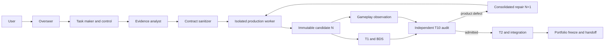

# Java-to-Bedrock AI factory skills

Updated: 2026-08-03

This is the operating guide for an AI receiving the Bedrock AI Factory on a
machine with no prior factory context. It explains what the skills do, how the
overseer assigns bounded sub-agents, which records are authoritative, and how
to recover without importing another machine's runtime state.

The repository is a portable control plane. It does not contain a modpack,
Java source, generated add-on, live campaign database, mailbox history,
credentials, Docker image, or proof that any client or platform gate passed.
Read [the live campaign lessons](docs/live-campaign-lessons.md) for the explicit
boundary between mechanisms bundled here, mechanisms proven in Studio but not
yet ported, and safety designs that remain unimplemented.

## The short version

One conversation-facing overseer owns orchestration. It does not author every
feature itself. It freezes authorized intake, creates hash-bound packets, and
starts a bounded role-specific sub-agent only when a packet is ready. Each
sub-agent receives one role, one assignment, one writable scope, and one
completion condition. Results become durable only through committed
repositories, SQLite records, Git mailbox commits, immutable candidate hashes,
and receipts.



Chat summaries, a running process, a clean server boot, and projected status
are not durable authority.

Product-lifecycle transitions use the chained canonical event envelope
documented in [the kernel control-plane reference](docs/kernel-control-plane.md).
The Git mailbox carries the portable audit history; SQLite lifecycle/frontier
state is rebuilt from that history and must compare exactly. Queue-internal
events remain scheduler diagnostics rather than product authority.

## First use on a new machine

From the repository root:

```bash
python3.11 tools/bootstrap.py --check-only
python3.11 tools/bootstrap.py
```

The first command checks the checkout and bundled skills. The second creates
`.venv` and installs the local package. Neither command installs skills into an
AI's global configuration.

Only after the user approves skill installation, run:

```bash
python3.11 tools/bootstrap.py --install-skills
```

That installs every directory under `skills/` into the selected Codex home and
backs up a different existing copy before replacement. A custom isolated Codex
home can be selected with `--codex-home ABSOLUTE_PATH`.

Initialize machine-local authority and prove the synthetic loop before using a
real modpack:

```bash
.venv/bin/python tools/factory/init_studio_factory.py \
  --root .mccompiler/factory-v1

.venv/bin/python tools/factory/rehearse_studio_factory.py \
  --factory-root .mccompiler/factory-v1 \
  --source ABSOLUTE_PATH_TO_AUTHORIZED_FIXTURE
```

Do not copy another machine's `.mccompiler`, SQLite database, mailbox, queues,
task IDs, worker branches, absolute paths, credentials, compatibility
exceptions, or runtime projections. Every machine initializes its own control
root and rehearsal receipt.

The rehearsal qualifies control flow, not the execution platform. Before a real
campaign, require a hash-bound `FACTORY_PLATFORM_QUALIFICATION` receipt covering
the launcher, sandbox, Codex executable/startup, ephemeral authentication,
lane-local home/cache and cwd, canonical paths, negative probes, privileged
broker, Docker/BDS adapter, cleanup, and process-receipt validation. A platform
component change invalidates the receipt; a workload or candidate change does
not. This branch does not bundle the broker and therefore fails closed.

## How skills and sub-agents work

Every bundled skill has:

- `skills/NAME/SKILL.md`: the role contract and operating instructions.
- `skills/NAME/agents/openai.yaml`: discovery metadata and the default prompt.
- Optional references, scripts, examples, or mechanical validators.

The overseer loads `oversee-java-to-bedrock-factory` as its governing skill.
It routes a ready packet to a smaller role skill; it does not send the entire
campaign prompt to every worker. A sub-agent must be rejected if its packet
does not match its role or lane.

A complete assignment binds at least:

```json
{
  "assignment_id": "opaque-stable-id",
  "campaign_id": "machine-local-campaign-id",
  "role": "one declared role",
  "skill": "one bundled skill",
  "lane": "EVIDENCE|CONTROL|PRODUCTION|QUALIFICATION|AUDIT|INTEGRATION",
  "input_hashes": {},
  "allowed_read_paths": [],
  "allowed_write_paths": [],
  "denied_paths": [],
  "required_outputs": [],
  "completion_condition": "one bounded result",
  "stop_codes": [],
  "requires_process_receipt": false
}
```

Production and repair roles require the real clean-room launcher and a
process-bound receipt. Merely hiding source paths from a prompt is not process
isolation. Evidence workers may inspect only authorized Java material;
production workers receive sanitized contracts and opaque requirement IDs,
never Java evidence or the private oracle.

## Factory role sequence

| Stage | Preferred skill | Durable completion |
|---|---|---|
| Campaign control | `oversee-java-to-bedrock-factory` | Next eligible action routed |
| Intake | `make-java-to-bedrock-task-packs` | Hash-bound task packs and activations |
| Evidence | `analyze-java-mod-evidence` | Private evidence claims and uncertainties |
| Sanitization | `sanitize-java-bedrock-contracts` | Frozen production-safe contract |
| Production | `work-bedrock-factory-pack` | Immutable candidate submitted |
| Specialized feature production | `produce-bedrock-cleanroom-feature` | Frozen feature candidate |
| T1 and BDS | `test-bedrock-factory-pack` | Mechanical and runtime result |
| Observation | `observe-bedrock-factory-pack` | Normalized evidence for T10 |
| T10 | `audit-bedrock-factory-pack` | PASS, defect, or narrow insufficiency |
| Repair | `work-bedrock-factory-pack` | Exact replacement generation `N+1` |
| Integration | `integrate-bedrock-factory-pack` | Frozen integrated candidate |
| Portfolio closure | `audit-bedrock-portfolio-freeze` | Full or partial classification |
| Handoff | `freeze-bedrock-campaign-bundle` | Slim immutable campaign bundle |

The deeper `run-java-to-bedrock-campaign` coordinator is available for a
full clean-room campaign. Routine operation should still enter through the
overseer so SQLite, mailbox, generation, dispatch, and scaling authority remain
unified.

## Candidate and repair lifecycle

Candidate states must not be collapsed:

1. Worker-local checks passed.
2. Candidate generation `N` was submitted privately.
3. Candidate was mechanically admitted.
4. Stable or Preview BDS lifecycle qualification ran.
5. Gameplay observations were collected with declared actor capabilities.
6. Independent T10 semantic disposition completed.
7. The slice was qualified.
8. Shared adapters or integrated product were frozen.
9. Client, console, Marketplace, and release gates ran separately, if ever.

A product defect preserves generation `N`. The mailbox owner consolidates
same-generation findings and authorizes one material repair as exactly `N+1`.
Every finding is linked to a new worker regression ID and the independent gates
that must rerun. Missing observation, unavailable infrastructure, or unsupported
actor capability does not authorize a product repair.

Never retry unchanged candidate bytes to obtain a more favorable streak.

## Activation ordinals, continuations, and repairs

Candidate generation and worker activation are different counters. Every launch
or reactivation has a new activation ordinal and receipt. A host-only recovery
or evidence-only continuation can therefore use a new activation while keeping
the exact candidate generation and product hash unchanged.

- `CONTINUE_NONTERMINAL` finishes missing evidence or another authorized
  non-product step and does not permit product edits.
- `RECOVERY_AFTER_INTERRUPTION` repairs delivery, launcher, host, or credential
  startup while preserving product bytes unless separate repair authority exists.
- `REPAIR_REQUIRED` binds one consolidated product finding against generation
  `N` and authorizes exactly one materially changed replacement `N+1`.

Do not convert infrastructure failure, unavailable actors, or missing
observation into a product repair. Preserve a blocked activation and a later
instrumented or recovered activation as different durable events.

## Standing campaign launch authority

A mechanically validated standing campaign authority may cover routine new,
continuation, repair, recovery, and bounded T2 activations while the frozen
source, rights basis, private scope, security model, role, lane, roots, denied
paths, and receipt policy remain unchanged. Ask the user again when rights,
source scope, the security model, authenticated identity, Realms, retail client,
console, publication, or release scope changes.

The standing-authority contract is documented here, but its newer mechanical
validator is `STUDIO_PROVEN_PORT_PENDING` and is not bundled in this branch.
Until a repository-owned validator is ported and passes locally, do not infer
standing authority from chat prose; obtain an explicit current authorization.

## Qualification does not all mean the same thing

- Static/T1 checks prove package mechanics and declared local invariants.
- Candidate-only BDS proves the exact pack loaded through the exercised server
  lifecycle.
- GameTest, Script Observer, direct hooks, and mutation harnesses prove only
  their calibrated paths.
- Protocol clients can prove selected network-player delivery, reconnect, and
  player/world scoping. Offline identities do not prove authenticated XUID,
  Xbox persistence, Realms, retail UI, controller, split-screen, rendering,
  audio, physical-console behavior, or authenticated retail behavior.
- A retail client is still required for rendering, UI, audio, controller, and
  other client-owned claims.
- Realms, split-screen, physical PS4, Marketplace, and release are separate
  external gates.

The observation worker records `OBSERVED_TRUE`, `OBSERVED_FALSE`,
`NOT_OBSERVED`, `UNSUPPORTED_BY_ADAPTER`, `INCONCLUSIVE`, or `CLIENT_REQUIRED`.
The T10 auditor decides semantic disposition. Structural JSON inequality by
itself is not a semantic failure, and absence of evidence is not falsehood.

## Capacity and heartbeat behavior

Starting pool sizes are two task makers, two production workers, one integration
worker, two testers, and one auditor. Observation collectors count as testers;
independent T10 review counts as audit. These are starting capacities, not a
fixed ratio.

Exactly one owner advances each adaptive heartbeat. A packet must be `READY` or
explicitly `capacity_blocked` before it creates capacity pressure. After two
eligible waiting heartbeats, one `SPAWN_THREAD` directive can bind to that exact
packet. After four idle heartbeats, one verified idle excess task can be
released. Active or leased work is never interrupted.

Stable BDS has two proven service slots. More conversation tasks do not create
Docker capacity. At the cap, apply upstream backpressure rather than starting a
third BDS execution.

Qualification consumes those slots only after authority and exact package
binding. Run the producer shadow and independent T1 first, then a one-cycle BDS
entrypoint smoke before the full restart/persistence sequence. Reuse prior gate
evidence only when candidate, gate implementation, runtime image, configuration,
and probe-authority hashes are all unchanged.

## Recovery after interruption

The AI reconstructs the frontier from:

1. Exact repository commits and clean/dirty state.
2. SQLite jobs, leases, events, and receipts.
3. Append-only Git mailbox commits and candidate generations.
4. Hash-bound dispatch requests and acknowledgements.
5. Adaptive-scaling state and open directives.

A sent request identity must not create a second worker. An assigned scaling
directive stays bound until its exact packet leaves the actionable queue.
Expired leases may be recovered only through the durable recovery rules. Chat
prose never overrides a conflicting committed record.

## Bundled skill catalog

### Core factory control

- `oversee-java-to-bedrock-factory`: user-facing controller, recovery,
  routing, scaling, and narrow status.
- `make-java-to-bedrock-task-packs`: authorized intake, deterministic packets,
  dependency closure, test matrices, and repair activations.
- `operate-bedrock-factory-mailbox`: SQLite/Git reconciliation, generations,
  supersession, dispatch, and repair authority.
- `work-bedrock-factory-pack`: one new, continuation, repair, adapter, or
  recovery activation with at most one immutable candidate.
- `test-bedrock-factory-pack`: T1 and exact-package Stable BDS without editing
  candidate bytes.
- `observe-bedrock-factory-pack`: calibrated instrumentation and protocol
  observations without semantic disposition.
- `audit-bedrock-factory-pack`: independent T10 semantic and hidden-case audit.
- `integrate-bedrock-factory-pack`: admitted shared adapter work and exact
  candidate integration.
- `translate-java-mods-to-bedrock`: concise end-to-end router and standards
  index for all factory roles.

### Evidence and clean-room roles

- `analyze-java-mod-evidence`: authorized evidence-only feature analysis.
- `sanitize-java-bedrock-contracts`: one-way source observation to abstract
  requirement to product-selected requirement transfer.
- `launch-cleanroom-production-worker`: actual deny-by-default worker process
  launch and receipt proof.
- `produce-bedrock-cleanroom-feature`: original Bedrock feature production from
  a sanitized contract.
- `integrate-bedrock-subsystem`: evidence-blind dependency-wave integration.
- `audit-java-bedrock-cleanroom`: full post-freeze semantic, isolation,
  lineage, mutation, originality, and qualification audit.

### Qualification and freeze

- `qualify-bedrock-candidate`: immutable Stable/Preview candidate execution and
  diagnostic planning.
- `qualify-bedrock-addon-bds`: architecture-aware exact BDS harness and receipt
  validation.
- `audit-bedrock-shipped-gameplay`: package wiring, media, progression, and
  desktop-smoke readiness.
- `audit-bedrock-portfolio-freeze`: final inventory, lineage, mutation, and
  full/partial classification.
- `freeze-bedrock-campaign-bundle`: slim immutable handoff without private Java
  evidence.

### Visual production

- `blockbench-build-bedrock-assets`: original Bedrock geometry, textures,
  rigs, animation, controllers, and console-conscious assets.
- `produce-golden-blockbench-asset`: one isolated high-value visual candidate
  with editable sources and deterministic exports.
- `audit-golden-blockbench-asset`: independent frozen visual candidate audit.

### Campaign planning

- `run-java-to-bedrock-campaign`: deeper acquisition-to-freeze campaign
  coordinator; use behind the normal overseer entrypoint.
- `crazycraft-quarter-distillation`: optional large-modpack scope reduction.
  Its historical name does not grant CrazyCraft rights or imply exact coverage.

Each detailed role contract lives at `skills/NAME/SKILL.md`. An AI should read
only the governing skill and the references that skill explicitly routes for
the current assignment.

## Copyable prompt for a new MacBook AI

```text
Read AGENTS.md, README.md, JAVA_BEDROCK_CODEX_SKILLS.md, and
docs/factory-overseer.md completely. This machine has no inherited factory
authority. Run the bootstrap check, but do not inspect a modpack or install
skills globally until I authorize those actions. Initialize a new machine-local
.mccompiler/factory-v1 root and run the offline synthetic rehearsal against an
authorized fixture. Report the exact config and receipt hashes.

After I provide an absolute modpack path and confirm inspection and private
clean-room authority, use oversee-java-to-bedrock-factory as the only
conversation-facing coordinator. Reconstruct decisions from SQLite, Git
mailbox commits, immutable candidate hashes, dispatch acknowledgements, and
receipts. Spawn only ready, bounded, role-specific sub-agents. Keep Java
evidence and the private oracle out of production. Route T1/BDS, gameplay
observation, T10, integration, client, console, Marketplace, and release to
their separate owners. Preserve failed generation N and authorize a material
repair only as N+1. Treat activation ordinals separately from candidate
generations. Never expose the host Docker socket to a sandboxed worker; stop
until a controller-owned least-authority broker exists. Keep all work private
and local unless I separately approve publication or release.
```

## Non-negotiable claims boundary

Synthetic rehearsal proves factory control flow, not a real conversion.
Candidate submission is not admission. BDS qualification is not gameplay,
client, console, or release proof. A qualified slice is not an integrated
product. No skill can grant legal rights, Marketplace acceptance, physical PS4
verification, or publication authority.
