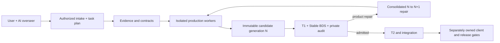

# Bedrock AI Factory

A portable, local-first control plane for an AI to coordinate clean-room
reconstruction of authorized Java mods into original Minecraft Bedrock Add-Ons.

Give this repository to an AI coding agent, point it at a local modpack you are
authorized to inspect, and the agent can plan and operate a durable multi-role
factory without importing this project's original campaign state.

> **Status: alpha factory infrastructure.** The synthetic rehearsal proves the
> control flow and recovery contracts. It does not prove that every mod can be
> converted automatically, that a generated pack is production-ready, or that
> client, console, Marketplace, legal, or release gates passed.

## What is included

- A deterministic, read-only JAR/ZIP/modpack intake planner.
- SQLite-backed jobs, leases, retries, events, receipts, and recovery.
- An independent append-only Git mailbox and immutable candidate generations.
- Hash-bound AI worker dispatch with duplicate-send prevention.
- Separate evidence, production, integration, qualification, and audit roles.
- Adaptive thread directives with explicit Stable BDS capacity limits.
- A macOS deny-by-default production launcher and receipt validator.
- Twenty-five Codex skills that teach an AI how to oversee and staff the factory.
- Unit tests and an offline end-to-end synthetic rehearsal.

The repository intentionally excludes modpacks, Java evidence, generated
add-ons, campaign databases, worker conversations, credentials, Docker images,
and machine-specific runtime state.

## Architecture



SQLite and the Git mailbox are durable authority. Agent chat, process presence,
and generated status projections are not.

## Requirements

- macOS for the included `sandbox-exec` production launcher. The queue and
  planning code are standard Python and can run elsewhere, but another OS needs
  an independently designed and qualified isolation backend.
- Python 3.11 or newer.
- Git.
- Codex or another coding agent that supports local skills and bounded workers.
- Docker plus a pinned Bedrock Dedicated Server setup only when you choose to
  run BDS qualification; those binaries/images are not bundled.

Minecraft, Bedrock, and Java are trademarks of their respective owners. This is
an independent developer tool and is not affiliated with Mojang or Microsoft.
Repository processing and disclosure boundaries are defined in
[AI_PROCESSING_POLICY.md](AI_PROCESSING_POLICY.md).

## Quick start

Clone the repository, then run:

```bash
python3.11 tools/bootstrap.py --check-only
python3.11 tools/bootstrap.py
```

The second command creates `.venv` and installs this checkout in editable mode.
It does not install skills globally unless you explicitly request that:

```bash
python3.11 tools/bootstrap.py --install-skills
```

Existing different skills are moved to a timestamped backup under the selected
Codex home before replacement. Use `--codex-home /absolute/path` to target an
isolated Codex configuration instead of the default.

Initialize a fresh local factory:

```bash
.venv/bin/python tools/factory/init_studio_factory.py \
  --root .mccompiler/factory-v1
```

Create or choose a small local JAR/ZIP fixture that you have permission to use,
then run the offline rehearsal:

```bash
.venv/bin/python tools/factory/rehearse_studio_factory.py \
  --factory-root .mccompiler/factory-v1 \
  --source /absolute/path/to/authorized-fixture.jar
```

The factory remains inactive until that deterministic rehearsal writes a PASS
receipt and binds its hash into `factory-config.json`.

## Give it to your AI

Open the repository as the agent workspace and send this prompt:

```text
Read AGENTS.md, README.md, JAVA_BEDROCK_CODEX_SKILLS.md, and
docs/factory-overseer.md completely. Set up this repository locally, but do not
inspect any modpack or install skills globally yet. Verify the synthetic
rehearsal and report the exact factory config and receipt hashes. Then ask me
for only: (1) the absolute path to the modpack, and (2) confirmation that I am
authorized to inspect it and run a private clean-room reconstruction. Keep
everything private and local unless I separately authorize publication. Use
the oversee-java-to-bedrock-factory skill as the only conversation-facing
coordinator and use bounded role workers for ready packets. Never treat
synthetic or server-only evidence as client, console, Marketplace, legal,
release, or full-automation proof.
```

After the user supplies authority and a source path, the overseer starts with:

```bash
.venv/bin/bedrock-factory \
  --db .mccompiler/factory-v1/orchestration.sqlite3 \
  factory-plan \
  --modpack /absolute/path/to/modpack \
  --output-root .mccompiler/factory-v1/campaigns/CAMPAIGN_ID \
  --authority RECORDED_AUTHORITY
```

Read [the AI skill and sub-agent operating guide](JAVA_BEDROCK_CODEX_SKILLS.md)
before starting a campaign on a machine that has not operated this factory.
Then see [the overseer runbook](docs/factory-overseer.md), the
[live campaign lessons and portability inventory](docs/live-campaign-lessons.md), and
[the queue/orchestration reference](docs/orchestration.md) for role ownership,
dispatch, recovery, and scaling commands.

## Safety model

- Intake hashes and lists archives without executing or extracting their
  contents.
- Raw evidence stays in evidence/control lanes. Production receives only opaque
  assignments and sanitized product contracts.
- Production and repair work require independent repositories, explicit read
  and write roots, denied evidence paths, and process-bound receipts.
- Candidate generations are append-only. A failed `N` is preserved and a
  material repair publishes exactly `N+1`; unchanged bytes are not retried.
- Product failures are separated from host, Docker, toolchain, and missing-gate
  failures.
- Public publication and release require separate user authority.

No sandbox can substitute for rights review, host hardening, or independent
qualification. Read [SECURITY.md](SECURITY.md) and the
[portability contract](docs/portability.md) before real production.

## Development

```bash
python3.11 -m unittest discover -s tests -v
```

The real macOS sandbox integration test is opt-in because it launches an actual
isolated subprocess:

```bash
RUN_STUDIO_SANDBOX_INTEGRATION=1 \
  python3.11 -m unittest tests.test_studio_production_sandbox -v
```

## License

MIT. Third-party mods, Minecraft assets, Bedrock server distributions, and
generated campaign artifacts are not included or licensed by this repository.
