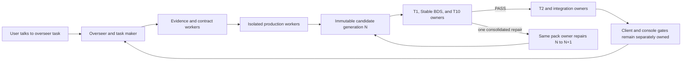

# Studio Java-to-Bedrock factory overseer

The interface is the Codex task conversation. There is no web UI, local HTTP
service, dashboard application, or second user-facing command console. The user
points this overseer task at an authorized local modpack; the overseer plans the
work, launches bounded role tasks, watches their durable messages, and reports
only decisions that genuinely require the user.

## Operating model



The durable control plane is Studio-local SQLite. Candidate and repair history
is append-only and generation-aware. Worker delivery uses a hash-bound outbox
that this Codex task consumes with subagents or worker tasks; it deliberately
does not depend on a particular UI transport.

The complete AI and sub-agent handoff is documented in
[`JAVA_BEDROCK_CODEX_SKILLS.md`](../JAVA_BEDROCK_CODEX_SKILLS.md). A fresh
machine should read that catalog before installing skills or activating a
campaign.
The [live campaign lessons](live-campaign-lessons.md) distinguish mechanisms
bundled in this distribution from newer Studio-proven behavior that still
requires a portable implementation.

This distribution does not import another factory's task IDs, absolute paths,
mailbox history, production repositories, compatibility exceptions, Docker
state, or runtime projections as local authority.

## Role pools

The overseer runs five separately bounded pools against one durable store:

| Pool | Lanes | Studio default |
|---|---|---:|
| `task_maker` | `EVIDENCE`, `CONTROL` | 2 |
| `production_workers` | `PRODUCTION` | 2 |
| `integration_worker` | `INTEGRATION` | 1 |
| `tester_workers` | `QUALIFICATION` | 2 |
| `audit_workers` | `AUDIT` | 1 |

The pools contain narrower roles. Evidence analysis and contract sanitization
prepare production-safe assignments. Production authors an immutable
candidate. Qualification owns T1 and BDS lifecycle results. Observation
collectors use the tester pool to gather calibrated gameplay evidence without
declaring equivalence. Audit workers own independent T10 disposition.
Integration begins only after the applicable admission authority exists.

Concurrency is a resource policy, not evidence strength. Stable BDS capacity is
increased only after distinct containers, ports, input roots, output roots, and
one-active-job-per-pack behavior are qualified at the new limit.

## Adaptive heartbeat capacity

The named pool defaults are starting bounds, not a fixed worker-to-auditor-to-
tester ratio. On every overseer reconciliation heartbeat, the adaptive
controller counts consecutive observations of actionable packets:

- `READY` is actionable. Ordinary dependency-blocked `WAITING` is not.
- A mailbox adapter may mark an otherwise actionable wait with the exact
  machine field `payload.capacity_blocked: true`.
- After two consecutive waiting heartbeats, one durable `SPAWN_THREAD`
  directive is emitted for the exact packet if the role and service cap permit.
- A directive remains bound to that packet from assignment until claim, so a
  slow task launch or overseer restart cannot duplicate it.
- Stable BDS is separately capped at two proven execution slots. At that cap,
  the decision is `BACKPRESSURE_UPSTREAM` against production, not a third BDS
  task pretending that another isolated Docker slot exists.
- Other saturated pools use the same backpressure form with their named
  upstream pool. The controller never silently exceeds configured maxima.
- After four fully idle heartbeats, excess conversation tasks may receive
  `RELEASE_IDLE_THREAD`. Active or leased work is never interrupted.

The state projection is restart-safe at
`.mccompiler/factory-v1/runtime/adaptive-scaling/state.json`. It does not alter
candidate generations or append-only mailbox history. A local cross-process
lock prevents torn or lost projection writes. Exactly one component advances a
logical heartbeat: the running `oversee` loop when present, otherwise the
conversation task. The conversation uses `scaling-status` while that loop is
active rather than advancing a duplicate cycle.

The overseer task reads or advances the controller mechanically:

```bash
.venv/bin/bedrock-factory \
  --db .mccompiler/factory-v1/orchestration.sqlite3 \
  scaling-heartbeat \
  --state .mccompiler/factory-v1/runtime/adaptive-scaling/state.json \
  --config .mccompiler/factory-v1/factory-config.json \
  --campaign CAMPAIGN_ID

.venv/bin/bedrock-factory scaling-ack \
  --state .mccompiler/factory-v1/runtime/adaptive-scaling/state.json \
  --config .mccompiler/factory-v1/factory-config.json \
  --directive DIRECTIVE_ID \
  --outcome ASSIGNED \
  --worker-task-id TASK_ID
```

## One-time Studio setup

From the repository root:

```bash
.venv/bin/python tools/factory/init_studio_factory.py \
  --root .mccompiler/factory-v1
```

Run the offline rehearsal against a local JAR or ZIP fixture:

```bash
.venv/bin/python tools/factory/rehearse_studio_factory.py \
  --factory-root .mccompiler/factory-v1 \
  --source /absolute/path/to/local-fixture.jar
```

The rehearsal must prove a deterministic plan, one worker dispatch, rejected
generation 1, one consolidated repair, immutable generation 2, T1/BDS/T10
results, role-pool start/stop, and replay equivalence. It does not set
`activation_allowed` by itself. Real campaign activation additionally requires
one exact factory-platform qualification receipt bound to the current launcher,
sandbox, Codex startup, ephemeral authentication, path policy, negative probes,
privileged broker, Docker/BDS adapter, cleanup, and receipt validators.

The platform qualification is reusable across workloads while every component
hash remains unchanged. A component change invalidates it; a candidate-byte
change does not. The broker is not yet bundled, so this distribution correctly
fails closed until an external qualified broker is supplied.

## Starting a real campaign from this task

The user supplies an absolute local modpack path and its operating authority.
The overseer records the authority and runs:

```bash
.venv/bin/bedrock-factory \
  --db .mccompiler/factory-v1/orchestration.sqlite3 \
  factory-plan \
  --modpack /absolute/path/to/modpack \
  --output-root .mccompiler/factory-v1/campaigns/CAMPAIGN_ID \
  --authority USER_OR_RECORDED_AUTHORITY
```

Intake is read-only: archive content is not imported, executed, or extracted.
The planner rejects source symlinks, special files, path traversal, duplicate
archive names, portable-name collisions, unsafe output overlap, and source
changes observed during hashing.

After planning, the overseer performs the routine loop:

1. Freeze exact source and plan hashes.
2. Separate opaque conversion units and prepare hash-bound assignments.
3. Send only ready assignments through the durable dispatch outbox.
4. Let workers run their owned local checks, freeze one candidate, and publish
   it without waiting for downstream PASS.
5. Route T1, Stable BDS, T10, T2, and integration work to their owners. Route
   calibrated GameTest, observer, or protocol-player collection through
   `observe-bedrock-factory-pack` before T10 whenever the contract requires
   gameplay evidence.
6. Route evidence-only work as `CONTINUE_NONTERMINAL` and host-only recovery as
   `RECOVERY_AFTER_INTERRUPTION`; both use a new activation ordinal while
   preserving candidate generation and bytes.
7. Consolidate product failures into one `REPAIR_REQUIRED` authority bound to
   rejected generation `N`; reactivate the same pack owner for exactly `N+1`.
8. Preserve every failed activation, generation, and append-only message.
9. Reconstruct after interruption from committed repositories, mailbox state,
   SQLite, and hash-bound outbox history.

The overseer can inspect unsent task requests with:

```bash
.venv/bin/bedrock-factory dispatch-pending \
  --outbox .mccompiler/factory-v1/runtime/dispatch
```

After this task successfully sends a request, it records the delivery once:

```bash
.venv/bin/bedrock-factory dispatch-ack \
  --outbox .mccompiler/factory-v1/runtime/dispatch \
  --request REQUEST_ID \
  --state SENT \
  --worker-task-id TASK_ID
```

Replaying a sent identity returns its history record rather than creating a
second worker.

## Validation ownership

A production worker owns only worker-local validation and freezing:

- schema and static checks;
- pack-local unit/integration checks;
- tests for the exact shipped scripts;
- deterministic build-twice verification;
- archive manifest, reference, and media integrity;
- restricted identifier/object scans;
- process-isolation receipt validation.

It must not request or wait for T1, Stable BDS, T10, T2, integration, desktop
client, Realms, controller, split-screen, PS4, Marketplace, or release results.
Those gates are scheduled by the overseer and executed by their named owners.

## User gates

Routine questions use task-pack fields and portfolio defaults. The overseer
stops for the user only when authority cannot be inferred safely:

- rights and operation authorization before source analysis or production;
- publication authorization before anything leaves the private factory;
- release/Marketplace authorization before final distribution.

A standing campaign launch authority can suppress repeated routine questions
only when a repository-owned validator binds the exact campaign, source,
rights, private scope, security model, role, lane, roots, denied paths, and
receipt policy to the activation. The validator is bundled, but it accepts only
an exact passing factory-platform qualification receipt. Until the broker and
the rest of that canary pass, obtain explicit current authority and do not infer
it from chat history.

No candidate publication depends on downstream PASS. Publication here means
submission of an immutable private candidate to the factory mailbox, not public
release.

## Valid worker stops

Workers report one structured stop code plus exact evidence. Free-form pauses,
requests for downstream testing, routine permission questions, and "local work
is done" are not valid stops. Accepted codes are enforced by
`orchestration/activation.py` and cover missing/conflicting/superseded authority,
repository or lease mismatch, missing sanitized contract, unavailable local
toolchain, clean-room violation, impossible stable API, publication-integrity
failure, ambiguous recovery state, and missing shared-runtime authority.

Never give a sandboxed worker the host Docker socket. A privileged host action
requires a controller-owned least-authority broker with allowlisted operations,
exact path and hash bindings, cleanup, and a receipt. That broker is
`REQUIRED_NOT_IMPLEMENTED`; if it is needed, stop as infrastructure-blocked
before worker startup and do not create a product finding or candidate.

## Status and recovery

The conversation-facing overseer status is available without a UI:

```bash
.venv/bin/bedrock-factory \
  --db .mccompiler/factory-v1/orchestration.sqlite3 \
  status --campaign CAMPAIGN_ID

.venv/bin/bedrock-factory \
  --db .mccompiler/factory-v1/orchestration.sqlite3 \
  events --campaign CAMPAIGN_ID --after LAST_SEQUENCE

.venv/bin/bedrock-factory \
  --db .mccompiler/factory-v1/orchestration.sqlite3 \
  mailbox-messages --campaign CAMPAIGN_ID

.venv/bin/bedrock-factory \
  --db .mccompiler/factory-v1/orchestration.sqlite3 \
  candidates --campaign CAMPAIGN_ID
```

The `oversee` command starts the bounded pools and reconciliation loop. It is a
runtime behind this conversation, not an interface replacing it:

```bash
.venv/bin/bedrock-factory \
  --db .mccompiler/factory-v1/orchestration.sqlite3 \
  oversee --runtime-root .mccompiler/factory-v1/runtime
```

Shutdown is cooperative: new claims stop, already leased work drains and writes
its receipt, then the process exits. Retry reopens only the repaired job and its
descendants; unrelated blocked branches remain blocked.
